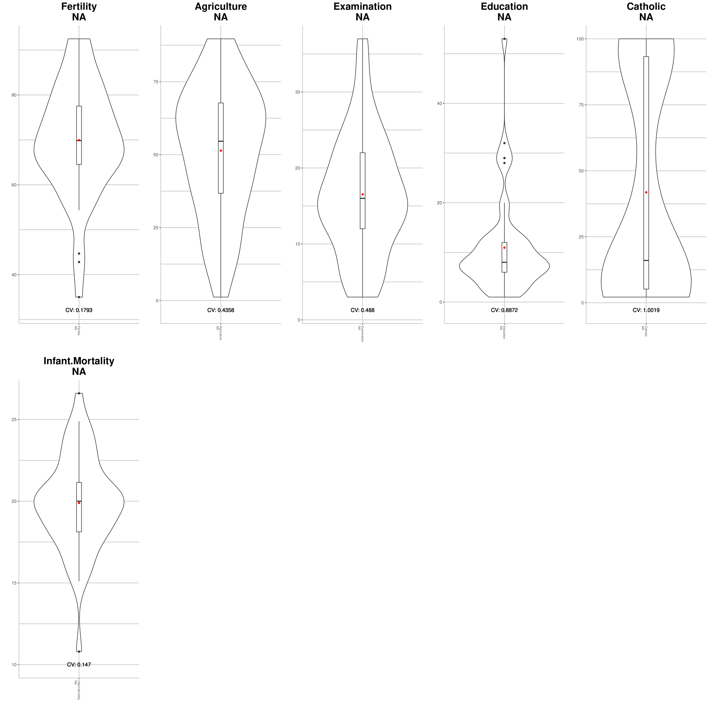
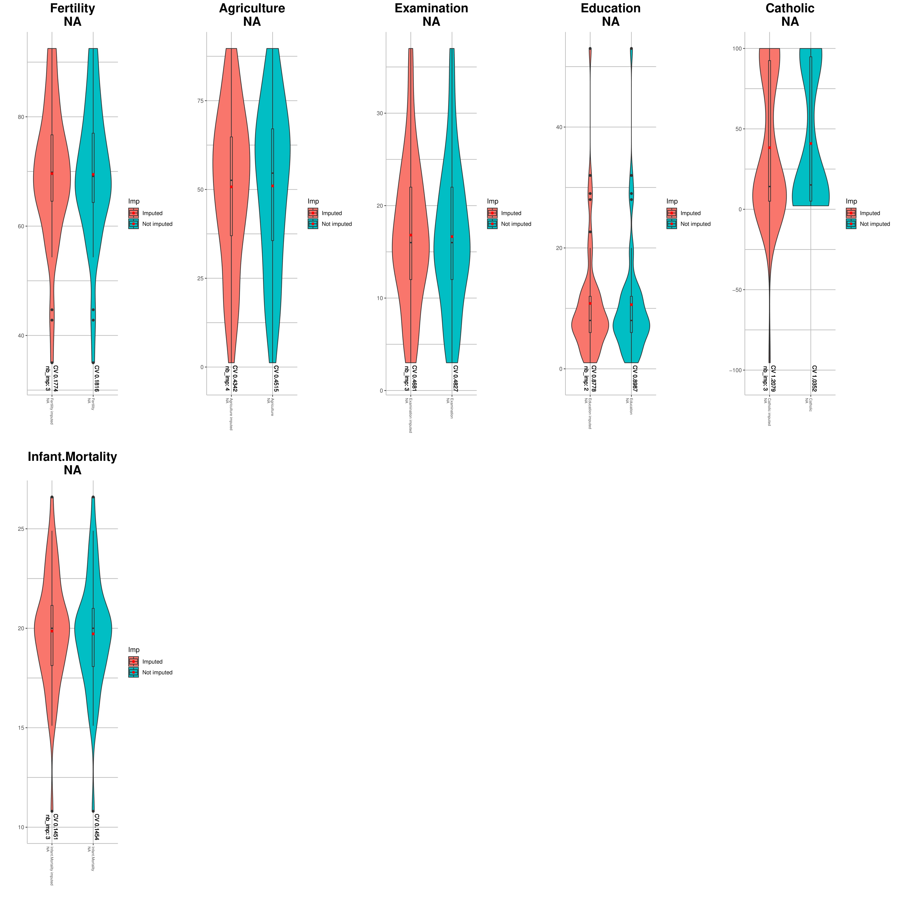
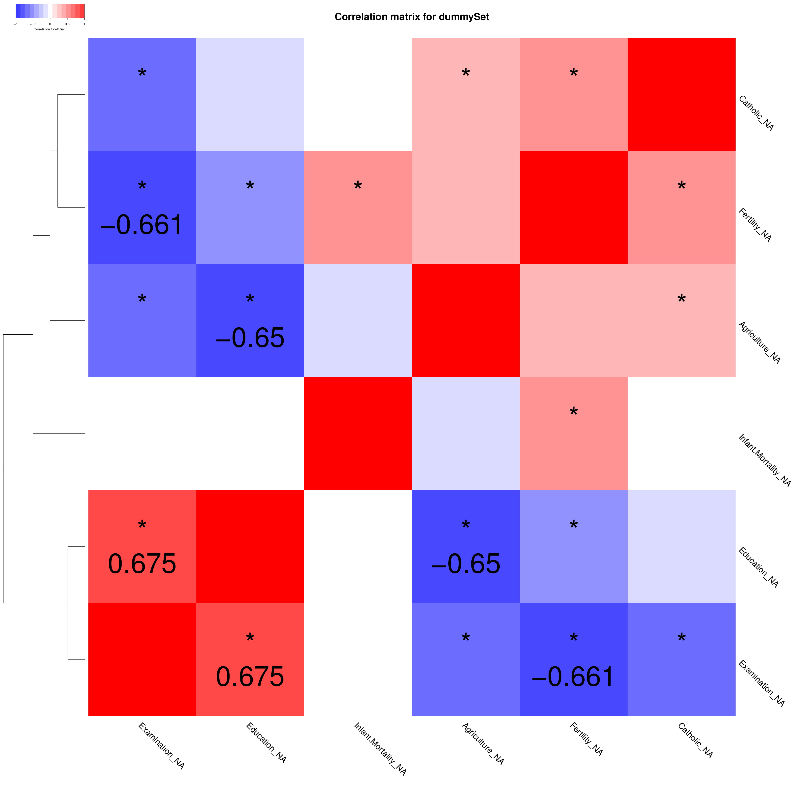
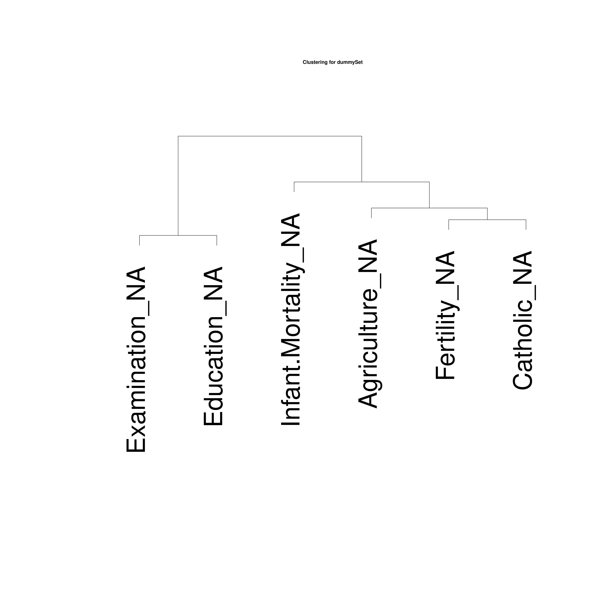

VIQCing
================

  - [Introduction](#introduction)
  - [Download](#download)
  - [Tutorial](#tutorial)
      - [QC Functions](#qc-functions)
          - [quality control](#quality-control)
          - [Output customization](#output-customization)
      - [Imputation](#imputation)
          - [Imputation of incomplete
            dataset](#imputation-of-incomplete-dataset)
          - [Imputation evaluation](#imputation-evaluation)
      - [Data Visualization](#data-visualization)
          - [Violin Plots](#violin-plots)
          - [Correlation](#correlation)
      - [Utility Functions for WGCNA](#utility-functions-for-wgcna-analysis)
          - [Regressions](#regresions)
  - [Contact and feedback](#contact-and-feedback)
  - [Citation](#citation)

## Introduction

The *VIQCing* (Visualization, Imputation, Quality Control) package has
been made to help processing Metabolomic Data. It contains a robust
pipeline that can be adapted depending on the input type and it needs.

## Download

Source code can be downloaded from github.

    git clone https://github.com/yilboudo/VIQCing.git

You can install in Rstudio using:

``` r
devtools::install_github("yilboudo/VIQCing") 
```

## Tutorial

The data used as input usually is a LC-MS or NMR Feature Matrix, with
the rows as metabolites and columns as samples. That said, as long as it
looks like the following dataset, the data can be used with this
package: (From the
    *datasets::swiss*)

    ##      dummyCompound dummyMetabolite Courtelary Delemont Franches.Mnt
    ## 1        Fertility              NA      80.20    83.10         92.5
    ## 2      Agriculture              NA      17.00    45.10         39.7
    ## 3      Examination              NA      15.00     6.00          5.0
    ## 4        Education              NA      12.00     9.00          5.0
    ## 5         Catholic              NA       9.96    84.84         93.4
    ## 6 Infant.Mortality              NA      22.20    22.20         20.2

### QC Functions

#### quality control

If you data contains **NA** values, you can filter the row with the
qualityControl() function.  
Produces the following files:  
1\. “QC\_data.txt”: Summary of the QC;  
2\. “REMOVED\_QC\_data.txt”: Summary of the removed metabolite;  
3\. output, cleaned dataset file(optional);  
4\. “REMOVED\_output.txt”, the removed set of metabolite (optional)

It will also warn you about potential problems. (e.g. if a line has sd
of 0 or NA) The function returns the cleaned dataset and QC summary.

``` r
#Write the data in a file
write.table(dat, file = "dummySet.txt",sep = "\t", row.names = FALSE)

result <- VIQCing::qualityControl("dummySet.txt", missing=0.2, compound=1, metabolite=2, sampleStart = 3)
```

    ## [1] "Saving QC data"

``` r
result$dataset[,1:5]
```

    ##           Compound Metabolite Courtelary Delemont Franches.Mnt
    ## 1        Fertility         NA      80.20    83.10         92.5
    ## 2      Agriculture         NA      17.00    45.10         39.7
    ## 3      Examination         NA      15.00     6.00          5.0
    ## 4        Education         NA      12.00     9.00          5.0
    ## 5         Catholic         NA       9.96    84.84         93.4
    ## 6 Infant.Mortality         NA      22.20    22.20         20.2

``` r
result$QC
```

    ##           compound cohort metabolite nbna        sd       mu        CV
    ## 1        Fertility                NA    0 12.491697 70.14255 0.1780901
    ## 2      Agriculture                NA    0 22.711218 50.65957 0.4483105
    ## 3      Examination                NA    0  7.977883 16.48936 0.4838200
    ## 4        Education                NA    0  9.615407 10.97872 0.8758220
    ## 5         Catholic                NA    0 41.704850 41.14383 1.0136356
    ## 6 Infant.Mortality                NA    0  2.912697 19.94255 0.1460544
    ##   remove
    ## 1  FALSE
    ## 2  FALSE
    ## 3  FALSE
    ## 4  FALSE
    ## 5  FALSE
    ## 6  FALSE

If we had a line with only **NA**, another one with all the same value
and a duplicate :

``` r
newDat <- result$dataset
newDat[nrow(newDat)+1,] <- 0 
newDat[nrow(newDat)+1,] <- 1
```

``` r
#Write the data in a file
write.table(newDat, file = "falsedummySet.txt",sep = "\t", row.names = FALSE)

result <- VIQCing::qualityControl("falsedummySet.txt", missing=1, compound=1, metabolite=2, sampleStart = 3)
```

    ## [1] "Saving QC data"

    ## Warning in VIQCing::qualityControl("falsedummySet.txt", missing = 1,
    ## compound = 1, : row 8 is a duplicated compound_metabolite: NA_NA

    ## Warning in VIQCing::qualityControl("falsedummySet.txt", missing = 1,
    ## compound = 1, : Sd == NA for row: NA_NA

    ## Warning in VIQCing::qualityControl("falsedummySet.txt", missing = 1,
    ## compound = 1, : Sd == 0 for row: NA_NA

``` r
result$dataset[,1:5]
```

    ##           Compound Metabolite Courtelary Delemont Franches.Mnt
    ## 1        Fertility         NA      80.20    83.10         92.5
    ## 2      Agriculture         NA      17.00    45.10         39.7
    ## 3      Examination         NA      15.00     6.00          5.0
    ## 4        Education         NA      12.00     9.00          5.0
    ## 5         Catholic         NA       9.96    84.84         93.4
    ## 6 Infant.Mortality         NA      22.20    22.20         20.2
    ## 7               NA         NA         NA       NA           NA
    ## 8               NA         NA       1.00     1.00          1.0

``` r
result$QC
```

    ##           compound cohort metabolite nbna        sd       mu        CV
    ## 1        Fertility                NA    0 12.491697 70.14255 0.1780901
    ## 2      Agriculture                NA    0 22.711218 50.65957 0.4483105
    ## 3      Examination                NA    0  7.977883 16.48936 0.4838200
    ## 4        Education                NA    0  9.615407 10.97872 0.8758220
    ## 5         Catholic                NA    0 41.704850 41.14383 1.0136356
    ## 6 Infant.Mortality                NA    0  2.912697 19.94255 0.1460544
    ## 7               NA                NA   47        NA      NaN        NA
    ## 8               NA                NA    0  0.000000  1.00000 0.0000000
    ##   remove
    ## 1  FALSE
    ## 2  FALSE
    ## 3  FALSE
    ## 4  FALSE
    ## 5  FALSE
    ## 6  FALSE
    ## 7  FALSE
    ## 8  FALSE

#### Output customization

``` r
# Use the customisation output function:
VIQCing::QCcustomization(result$QC, REMOVE=FALSE)
```

    ##           compound cohort metabolite nbna        sd       mu        CV
    ## 1        Fertility                NA    0 12.491697 70.14255 0.1780901
    ## 2      Agriculture                NA    0 22.711218 50.65957 0.4483105
    ## 3      Examination                NA    0  7.977883 16.48936 0.4838200
    ## 4        Education                NA    0  9.615407 10.97872 0.8758220
    ## 5         Catholic                NA    0 41.704850 41.14383 1.0136356
    ## 6 Infant.Mortality                NA    0  2.912697 19.94255 0.1460544
    ## 7               NA                NA   47        NA      NaN        NA
    ## 8               NA                NA    0  0.000000  1.00000 0.0000000

### Imputation

#### Imputation of incomplete dataset

Impute the given dataset with different method options. Produces
filename\_imputed.txt, containing the imputed dataset;

Available imputation methods:

1.  “knn”: From the *impute* package, use the k nearest neighboors to
    impute the values;  
2.  “RF”: From the *missForest* package, use RandomForest algorithm to
    impute the values;  
3.  “QRILC”: From the *imputeLCMD* package, use Quantile regression to
    impute the values;  
4.  “SVD”: From the *pcaMethods* package, use SVDimpute algorithm as
    proposed by Troyanskaya et al, 2001. to impute the values;  
5.  “mean”,“median”, "“median”, “0”, “HM”: simple value replacement,
    either by the mean, median, 0 of Half minimum of the row;

returns the imputed Dataset

If we create some holes in the previous dataset:

    ##           Compound Metabolite Courtelary Delemont Franches.Mnt
    ## 1        Fertility         NA         NA    83.10         92.5
    ## 2      Agriculture         NA      17.00    45.10         39.7
    ## 3      Examination         NA      15.00     6.00           NA
    ## 4        Education         NA      12.00     9.00          5.0
    ## 5         Catholic         NA       9.96    84.84           NA
    ## 6 Infant.Mortality         NA         NA    22.20         20.2

``` r
result <- VIQCing::imputation("holesdummySet.txt", method = "SVD", transformation = "scale", compound = 1, metabolite = 2, sampleStart = 3)
```

    ## [1] "saving imputated data"

``` r
result[, 1:5]
```

    ##           Compound Metabolite Courtelary Delemont Franches.Mnt
    ## 1        Fertility         NA     81.522    83.10       92.500
    ## 2      Agriculture         NA     17.000    45.10       39.700
    ## 3      Examination         NA     15.000     6.00       14.148
    ## 4        Education         NA     12.000     9.00        5.000
    ## 5         Catholic         NA      9.960    84.84       13.156
    ## 6 Infant.Mortality         NA     26.609    22.20       20.200

#### Imputation evaluation

You can use the NRMSE function to evaluate the accuracy of the
imputation:

``` r
# Only input the Samples, not the compound/metabolite columns
VIQCing::NRMSE(result[,3:dim(result)[2]], dat[,3:dim(dat)[2]])
```

    ## [1] 0.288641

You can also use the imputationTest() function, which will produce a
more complete output of the NRMSE when asked. It is advised to test most
of the methods and transformation on your own datasets to determine the
optimal imputation
method.

``` r
VIQCing::imputationTest("dummySet.txt", method="SVD", transformation = "scale", nbTest=15, sampleStart = 3)
```

    ## [1] " Test run # 1"
    ## [1] " Test run # 2"
    ## [1] " Test run # 3"
    ## [1] " Test run # 4"
    ## [1] " Test run # 5"
    ## [1] " Test run # 6"
    ## [1] " Test run # 7"
    ## [1] " Test run # 8"
    ## [1] " Test run # 9"
    ## [1] " Test run # 10"
    ## [1] " Test run # 11"
    ## [1] " Test run # 12"
    ## [1] " Test run # 13"
    ## [1] " Test run # 14"
    ## [1] " Test run # 15"

    ##      Method missing_proportion transformation NRMSE              
    ## [1,] "SVD"  "0.05"             "scale"        "0.123058948691335"

### Data Visualization

#### Violin Plots

##### Violin Plot on starting data

It is possible to visualize the distribution of your metabolomic data
with Violin Plots. It will produce a .pdf
file.

``` r
VIQCing::violinPlotQC("dummySet.txt", na=TRUE, compound=1, metabolite=2, sampleStart = 3)
```

    ## [1] "Computing stats"
    ## [1] "Plotting"
    ## [1] "Saving PDF file"



##### Violin Plot to compare imputed data with original data

You can use violinPlotImp() to compare the distribution of your data
before and after
imputation:

``` r
VIQCing::violinPlotImp("holesdummySet.txt", "holesdummySet_imputed.txt",na=TRUE, compound=1, metabolite=2, sampleStart = 3, compoundImp = 1, metaboliteImp = 2, sampleStartImp = 3)
```

    ## [1] "Computing stats"
    ## [1] "Plotting"
    ## [1] "Saving PDF file"



#### Correlation

##### Matrix and Tree

It is possible to build a correlation matrix and its associated
correlation tree for the given dataset. Both plots are optional and the
correlation test can be decided.  
The function also produces:  
1\. “filename.pdf”, containing the asked plots;  
2\. “filname\_pairs.txt”, containing the correlation pairs  
returns the correlation matrix “r” and the p-value matrix
“P”

``` r
VIQCing::corMatrix("dummySet.txt", na=TRUE, compound=1, metabolite=2, sampleStart=3, testType="spearman", textSize = 5)
```

    ## Warning in VIQCing::corMatrix("dummySet.txt", na = TRUE, compound = 1, metabolite = 2, : Application conditions for Spearman's Correlation test
    ##        - Independent samples -> assumed

    ##                     Fertility_NA Agriculture_NA Examination_NA
    ## Fertility_NA                1.00           0.24          -0.66
    ## Agriculture_NA              0.24           1.00          -0.60
    ## Examination_NA             -0.66          -0.60           1.00
    ## Education_NA               -0.44          -0.65           0.67
    ## Catholic_NA                 0.41           0.29          -0.48
    ## Infant.Mortality_NA         0.44          -0.15          -0.06
    ##                     Education_NA Catholic_NA Infant.Mortality_NA
    ## Fertility_NA               -0.44        0.41                0.44
    ## Agriculture_NA             -0.65        0.29               -0.15
    ## Examination_NA              0.67       -0.48               -0.06
    ## Education_NA                1.00       -0.14               -0.02
    ## Catholic_NA                -0.14        1.00                0.07
    ## Infant.Mortality_NA        -0.02        0.07                1.00
    ## 
    ## n= 47 
    ## 
    ## 
    ## P
    ##                     Fertility_NA Agriculture_NA Examination_NA
    ## Fertility_NA                     0.1003         0.0000        
    ## Agriculture_NA      0.1003                      0.0000        
    ## Examination_NA      0.0000       0.0000                       
    ## Education_NA        0.0018       0.0000         0.0000        
    ## Catholic_NA         0.0039       0.0491         0.0007        
    ## Infant.Mortality_NA 0.0021       0.3073         0.6929        
    ##                     Education_NA Catholic_NA Infant.Mortality_NA
    ## Fertility_NA        0.0018       0.0039      0.0021             
    ## Agriculture_NA      0.0000       0.0491      0.3073             
    ## Examination_NA      0.0000       0.0007      0.6929             
    ## Education_NA                     0.3328      0.8992             
    ## Catholic_NA         0.3328                   0.6588             
    ## Infant.Mortality_NA 0.8992       0.6588




Output file “dummySet\_pairs.txt” :

    ##      metabolite1    metabolite2        cor       pvalue
    ## 1 Examination_NA   Fertility_NA -0.6609030 4.281527e-07
    ## 2   Education_NA Agriculture_NA -0.6504638 7.457269e-07
    ## 3   Education_NA Examination_NA  0.6746038 1.998543e-07


###Utility Functions for WGCNA

